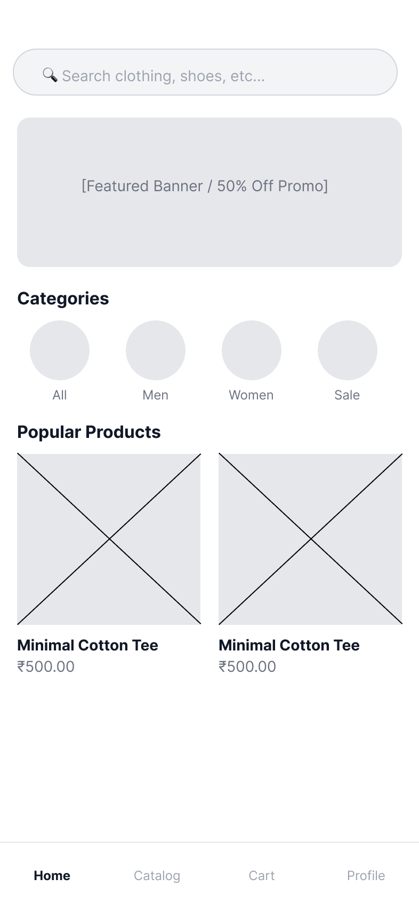
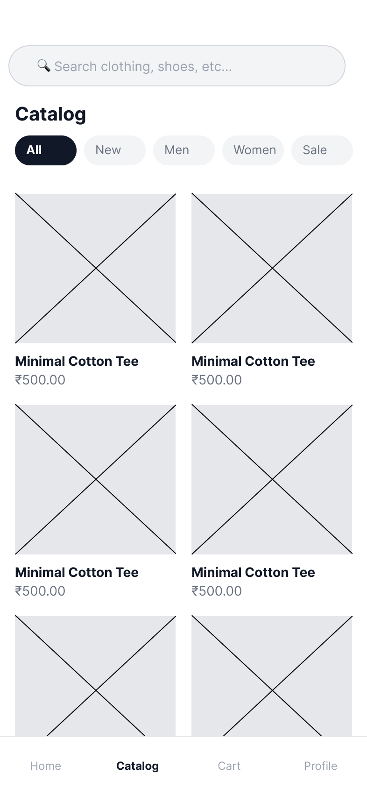
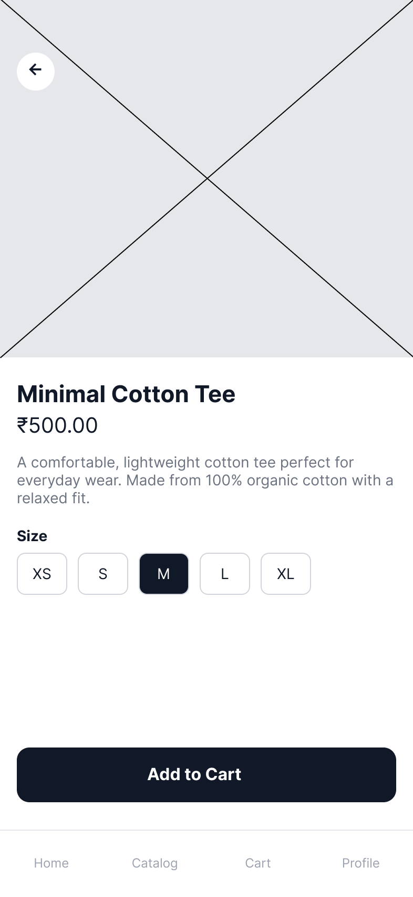
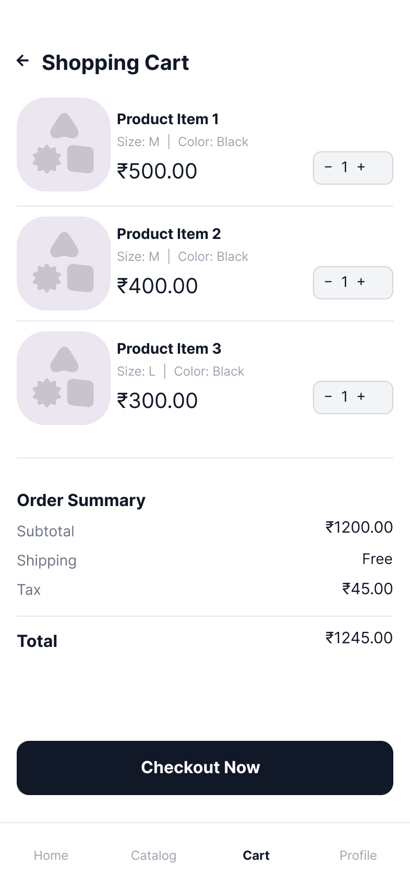

# Mobile App Wireframe — QuickCart (Low-Fidelity)

A 4-screen low-fidelity mobile application wireframe designed in Figma for an apparel e-commerce platform. The project focuses on layout hierarchy, intuitive user journeys, touch-target accessibility, and early-stage design thinking.

---

## 🔗 Live Figma Project
- **Figma Design File:** [Open Figma Project](https://www.figma.com/design/z8BRqvTqW8uilLQQkAFfs6/Untitled?node-id=0-1&t=d68Qv1AYcjqwDlLB-1)

---

## 📱 Wireframe Screens

| 01. Home Screen | 02. Product Catalog | 03. Product Detail | 04. Cart & Summary |
|:---:|:---:|:---:|:---:|
|  |  |  |  |

> *(Note: Export your 4 frames as PNGs from Figma, create a folder named `screenshots` in this repo, and upload them as `01_home.png`, `02_catalog.png`, `03_detail.png`, and `04_cart.png`)*

---

## 🧠 Design Thinking Process

### 1. Empathize & Define (User Research)
* **Problem Statement:** Online mobile shoppers often face cluttered visual hierarchies, misleading discount popups, and non-transparent checkout flows that increase abandonment.
* **Target Audience:** College students and young adults seeking an efficient, uncluttered apparel shopping experience on mobile devices.

### 2. User Persona
* **Name:** Jordan Lee (Age 23 — Student / Tech Enthusiast)
* **Goal:** Quickly filter apparel by category/size, preview clean specifications, and check out with an itemized cost breakdown.
* **Frustrations:** Complicated multi-step forms, unorganized product cards, and hidden shipping charges.

### 3. Core User Flow
```text
[Home Discovery] ──> [Catalog & Filter] ──> [Product Detail Page] ──> [Cart & Checkout]
